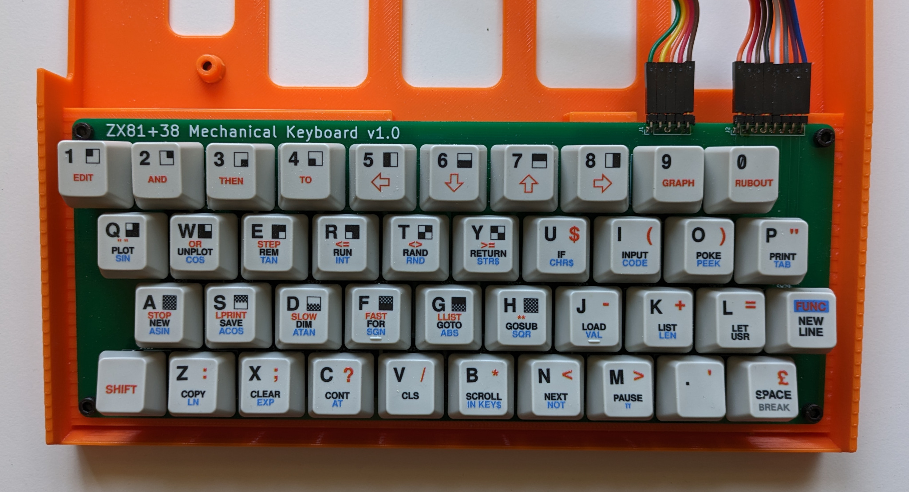
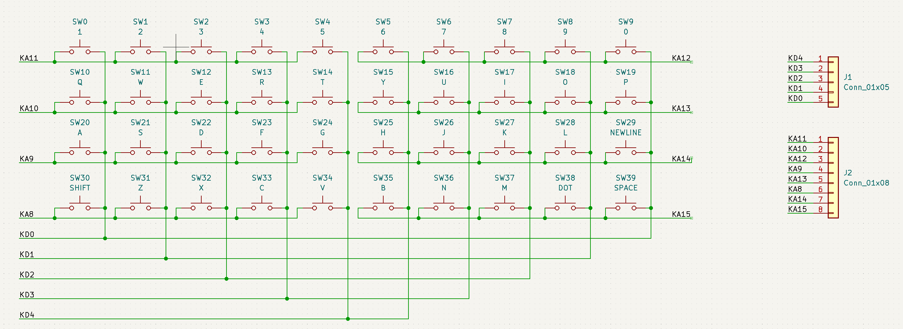
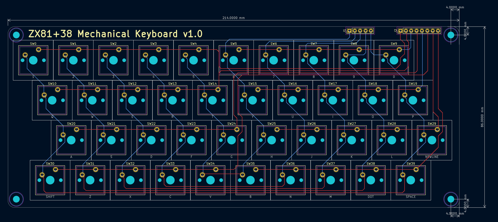
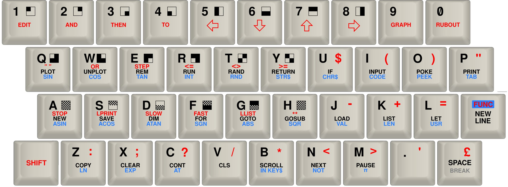

### ZX81 Mechanical Keyboard

A mechanical keyboard that's compatible with the Sinclair ZX81, as well as the
ZX81+38 modern recreation of that machine.  This repository contains all the
design files as well as various exported versions and images.  Please carefully
review any files before you use them to order hardware!

The KiCAD files for the schematic and layout are provided.
The [export](export/) directory contains PDF versions for convenient online
viewing.  The [gerbers](gerbers/) directory contains the exported gerbers
I generated for an order of five PCBs from JLCPCB.

The custom keycaps were ordered via wasdkeyboards:
https://www.wasdkeyboards.com/61-key-custom-cherry-mx-keycap-set.html

In the [keycaps](keycaps/) directory there are two versions of the SVG files,
based on the template provided by wasd.  The "paths" version has been converted
to paths and is suitable for submitting for an order.  The other version keeps
the text elements as text for easier editing, but must be converted to paths
before using for ordering.

### Need a ZX81 to add a keyboard to?

The ZX81+38 project is a modern recreation of the ZX81 mainboard using
74xx series ICs, similar to the ZX80, instead of the (no longer manufactured)
ULA used in vintage ZX81s.  Check it out:

https://github.com/mahjongg2/ZX81plus38

https://revspace.nl/ZX81plus38_simple_to_build_ZX-81_clone 

https://forums.raspberrypi.com/viewtopic.php?t=254492
